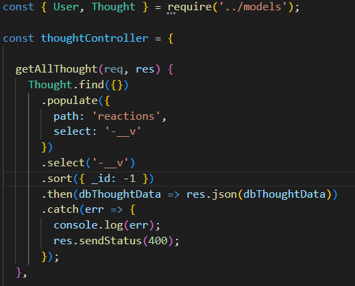
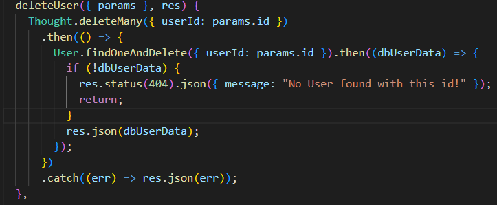
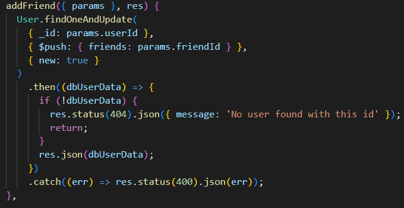
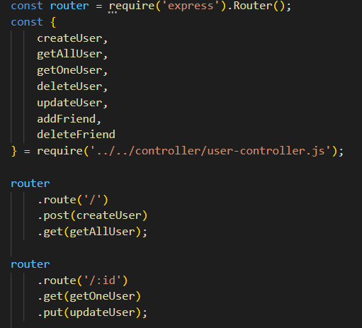
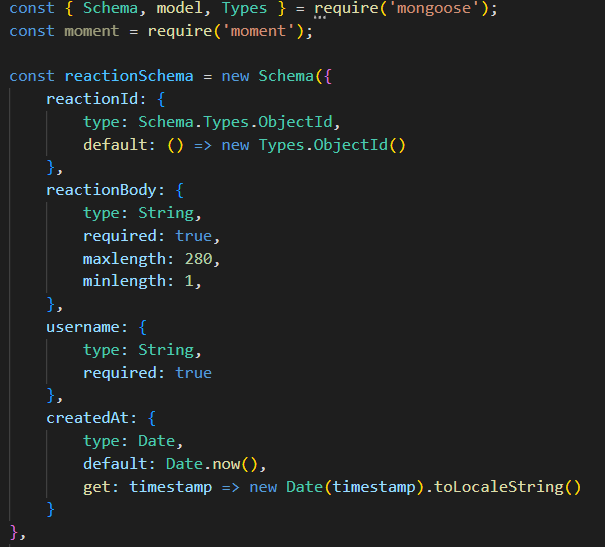

# Social Media Network Backend

## Description
This is a Mongoose based backend to some sort of social media application. You are able to create a User, post your Thoughts, and even React to others' Thoughts. You are also able to update and delete any of those features at will.  You may view the repository at the [Deployed](https://github.com/DStefani86/social-media-network-api).

## Video Walkthrough

[Walkthrough]https://drive.google.com/file/d/1g6rPjQqeSardy24NGaC0_Z40PNmSvIXA/view

## Table of Contents

[Installation](#installation)

[Usage](#usage)

[License](#license)

[Contributors](#contributions)

[Tests](#tests)

[Questions](#questions)

## Installation
Visit my GitHub repository featured in the Questions section below. Find the Employee Tracker repository. Clone the SSH down from my the repository into your own terminal and enjoy! Make sure to run `npm install` in your terminal before engaging this application and running `npm start` to begin the server. Best tested via insomia.

## Usage

I am including some examples of my code to demonstrate the functionality of my application. First thing I'd like to showcase are my controllers for the Users and Thoughts. 

This is how I deleted all thoughts from a User upon destroying that ID 

Adding Friends by ID

An example of some of my User routes

This is my Thought model which features a timestamp function!! 

If you have any other curiosities about the functionality of this application please watch the tutorial video I have included above the Table of Contents

## License 
This application is licensed by MIT

## Contributions
The Studious Studiers Discord!!
Geronimo Perez

## Tests
.

## Questions
You can reach me at stefanibusiness@gmail.com or via GitHub [DStefani86](https://github.com/DStefani86)

